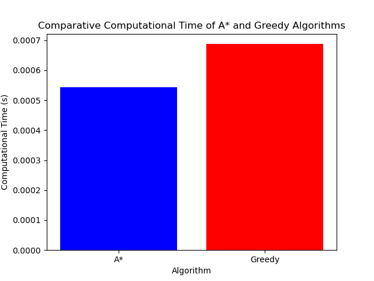

# A* vs. Greedy Best-First Search: Performance Comparison in Python

This project compares the A* and Greedy Best-First Search algorithms using a maze generated by the [Pyamaze](https://github.com/MAN1986/pyamaze) library. It evaluates each algorithm on:

- Path length
- Number of nodes explored
- Computational time
- Max size of the open set
- Total nodes generated

## Features

- Visual maze generation and agent path-tracing
- Timing and performance metrics
- Bar chart visualisation of computational time using `matplotlib`
- Structured and documented Python code

## Sample Output



## Setup

```bash
pip install -r requirements.txt
